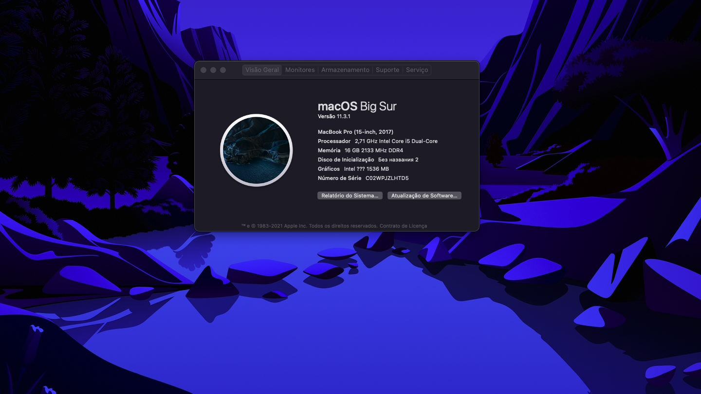

# This is a WIP



### What's working
- [x] HDMI + Audio
- [x] Brightness control
- [x] Gestures
- [x] Audio & headphone jack
- [x] Ethernet 
- [x] Usb 3.0 + Type C
- [x] WiFi (2.4 + 5GHz) using INTEL8620


### Won't working
- [ ] 940MX (dGPU) 
- [ ] Bluetooth using INTEL8620


# How to Install

```
Just copy EFI folder to your OPENCORE partition.
```
